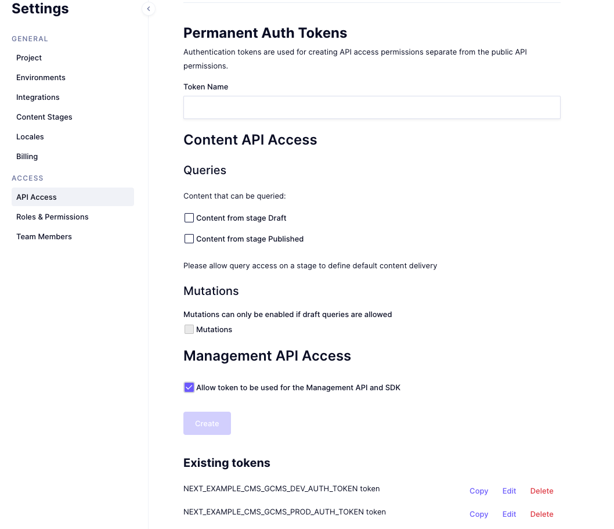

# graphcms-markdown-migrator

This package aims to help the migration from static markdown files to GraphCMS for your blog (or wathever you've built using markdowns).

[GraphCMS is an headless cms](https://graphcms.com/academy/headless-cms) and allows you to create entities (which are called models) and expose graphql mutations and queries to manage them. 
It also gives you an admin UI to create istances of these entities. They also have a [gatsby connector](https://www.gatsbyjs.com/docs/sourcing-from-graphcms/) and therefore it might be just perfect for your blog whereas you'll have a "Post" entity and you'll manage your posts in their UI.

  

## What does this migrator do?

Basically you can give it a folder full of md files and it will try to create a "Post" entity on your GraphCMS istance and it will just create as many posts as the number of your md files with their content in it. (it will recursively find the files between all your folders).
  
**This package will try to recreate the model from the first markdown it encounters.** 
This means that if you have markdowns with different yaml sections, you need to create two separate folder where you'll run this migrator. 

## Prerequisites

- The url of your GraphCMS istance
- A token with the "Management API Access" turned on 

## Usage

just run `npx md-to-graphcms --path ./your-path --url https://your-istance.com --token <token>` and watch the magic happen :)

### TODO

- Adding logs
- Adding tests
