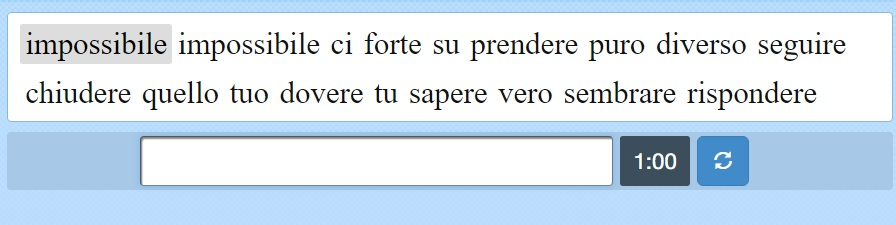
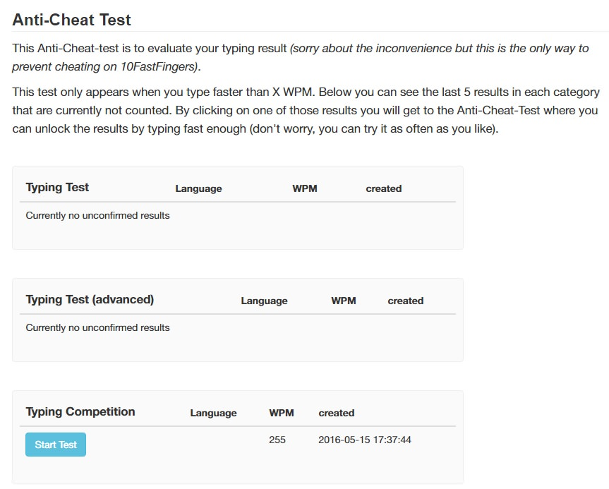
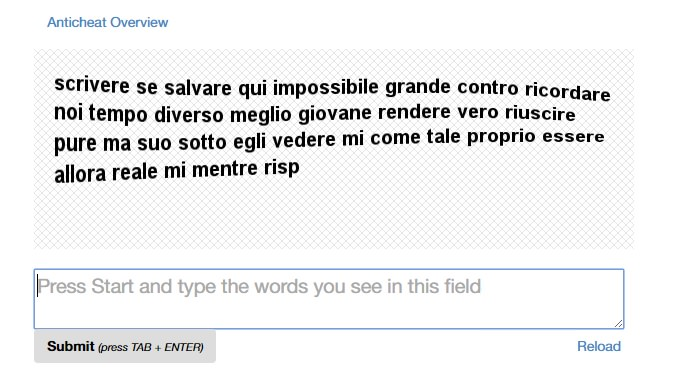
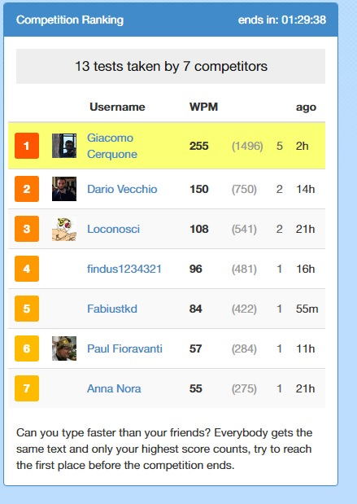

Occasionally, I enjoy writing on the keyboard of my precious laptop as fast as hell and due to this “hobby”, if we can call it like that, some years ago I discovered this wonderful website of competition for freaks like me: [10fastfingers.com](http://www.10fastfingers.com)! It basically calculates how many words read from a board you can write in one minute. I have an average of 105 wpm with peaks that reach 112 wpm. I’ve never tried to cheat the system, I don’t give a damn about my scores, if I do things like these, it’s because I enjoy thinking and coding a way to achieve what I want.

## Here's how I cheated it - First phase

I already knew that the first part would have been easy. These are the words you have to type:



The word you have to write has an "highlight" css class and the input field where you have to insert the word has id "inputfield".
So you just need to open the chrome console and paste this little script wrote in 30 seconds:

```javascript
setInterval(function() {
  $("#inputfield").val($(".highlight").text())
})
```

Two or three considerations: I used jQuery because it’s already used and included in the website. It repeats every 4 milliseconds (the default timeout for setInterval) the action of getting the text from the highlighted word and putting it in the input field. The only boring thing that you need to do is keep pressing the space key everytime a new word appear. There are of course ways to bypass this but I didn’t want to solve this problem too because I’d have spent too much time.
Very well, it worked like a charm but now the problem is another one. Straight after I received a notification where I had to certify that I wasn’t cheating.



## Second phase

And now lets face the "real" problem. To certify that I wasn't cheating, while I was cheating :D, I had to do the same thing but with an image. This is a screenshot that can give you an idea:



Now to achieve this I started searching for some [OCR](https://en.wikipedia.org/wiki/Optical_character_recognition) library for javascript but I was already loosing too much time and I didn’t want to re-build the wheel. I preferred so to search for some online ocr recognizer and in fact some of them are really good. But going with this solution, made me waste a lot of time and of course the anticheat system checks also the amount of time you spend to write that shit down.
So I ended up using the wonderful [Capture2Text](https://sourceforge.net/projects/capture2text/): you just need to press win+q, select the area where you want to extrapolate the text and when the program has converted the image to text (it’s very fast actually) you can do ctrl+v already considering that the text has already been copied inside your clipboard.

At the end I was the first on the ranking board with 255 words per minute :)



## There are other people who tried this, but...

While I'm writing this post I saw that also other people, obviously, did the same thing with the old version of 10fastingers where there was no anticheat system. They just had to use plain javascript and their result was accepted!
But now, with this, we solved every problem. Hope you won't use this to cheat in the community, if you're not good enough to do what I did or to write very fast words on your keyboard, I think you should not use this cheat!

Stay awesome!
